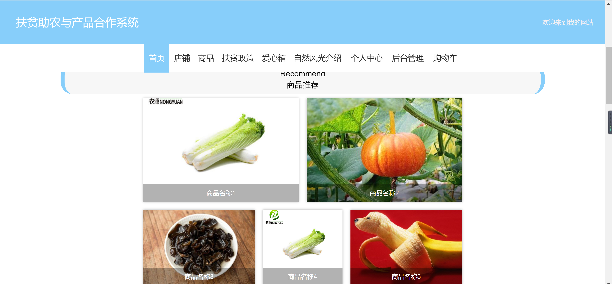
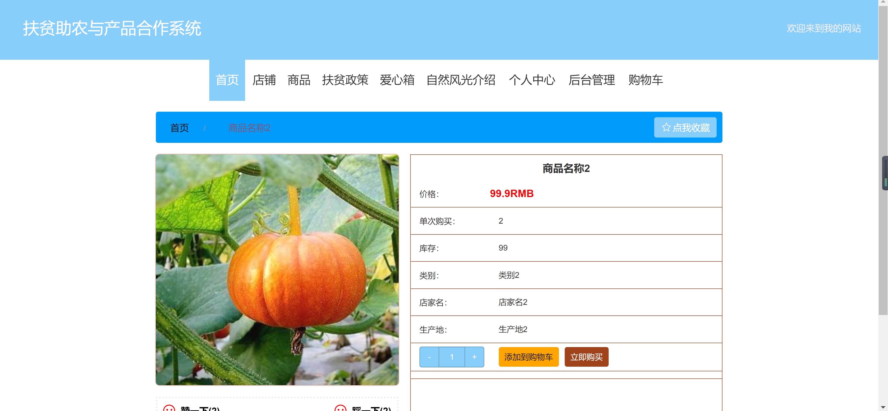
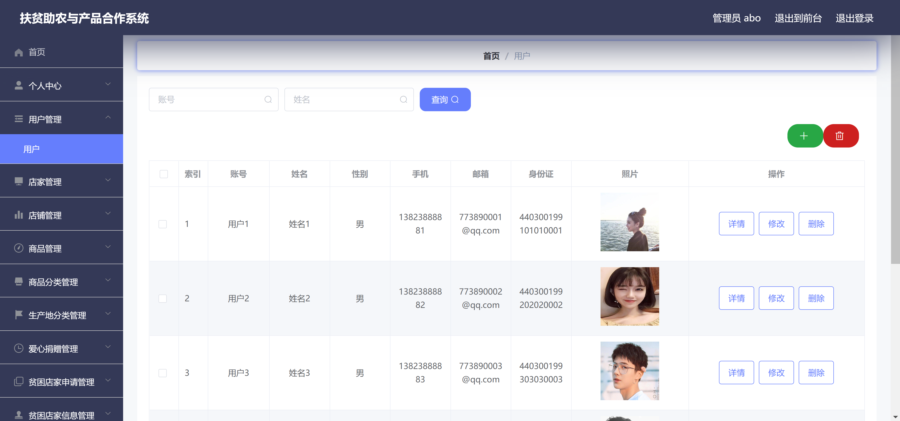

<h1 align="center">扶贫助农管理系统</h1>

## 简介
扶贫助农管理系统：角色分为管理员、用户、店家；功能包括用户管理、店家管理、商品管理、爱心捐赠管理、购物车、注册登录。系统支持电商活动与扶贫政策信息展示。    --计算机毕业设计源码；毕设源码；java毕业设计源码

## 联系方式

<h3 align="center">获取完整代码与数据库文件 + 微信：bysj5151 QQ: 86050149 QQ群: 783742310</h3>

<h3 align="center">可帮忙远程部署 包运行成功！提供远程部署、修改代码、设计文档指导、代码讲解等服务！</h3>

## 功能介绍（完整见运行截图）
管理员： 负责管理和维护系统，具备登录、注册、退出功能，并能通过用户管理、店家管理、商品管理和爱心捐赠管理等模块进行系统操作。可以添加、编辑、删除用户及管理商品信息，通过后台管理支持系统的整体运营。

用户： 能通过首页导航栏访问商品推荐、扶贫政策与店铺展示等内容。用户可以进行商品搜索、查看商品详情，并使用购物车进行在线选购。个人中心允许用户查看与修改个人信息，管理订单、地址及收藏夹，提升用户的购物体验。

店家： 负责商品的上传与管理，店家可以在店家管理模块下更新店铺信息，并与用户进行商品的交易。支持店家注册与登录，通过该系统与更多用户达成合作，促进扶贫产品的推广与销售。

其它角色： 不同角色均可参观自然风光介绍，通过爱心箱参与扶贫助农活动，增加平台的公益性和互动性，提升用户参与度，对扶贫助农有更全面的支持和贡献。

## 运行截图

本代码来源于网络,仅供学习参考使用!

